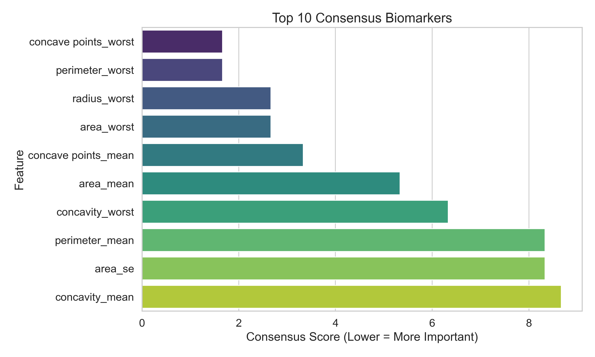

#  Feature Selection & Biomarker Identification for Breast Cancer Detection

This project identifies the most important **biomarkers for breast cancer detection** using advanced **feature selection methods**.  
We apply **ANOVA F-Test**, **Random Forest Importance**, and **Recursive Feature Elimination (RFE)**, then combine the rankings to produce a **consensus list of top biomarkers**.

---

##  Project Structure
Feature_Selection_Biomarker_Identification/
│
├── data/ # All datasets
│ ├── raw/ # Raw dataset(s)
│ └── processed/ # Processed/cleaned dataset(s)
│
├── notebooks/ # Jupyter notebooks for each step
│ ├── 01_data_preprocessing.ipynb
│ ├── 02_exploratory_data_analysis.ipynb
│ ├── 03_feature_selection.ipynb
│ └── 04_final_biomarker_ranking.ipynb
│
├── results/ # Output results
│ ├── tables/ # CSV files of rankings
│ ├── figures/ # Plots & charts
│ └── reports/ # Markdown/PDF reports
│
├── docs/ # Additional documentation (optional)
│
├── README.md # Project overview (this file)
└── requirements.txt # Python dependencies

---

##  Notebook Execution Order

Run the notebooks in the following order for reproducibility:

1. **`01_data_preprocessing.ipynb`** → Load raw dataset, clean, encode, and save to `data/processed/`.
2. **`02_exploratory_data_analysis.ipynb`** → Perform EDA, visualize distributions, correlation heatmaps.
3. **`03_feature_selection.ipynb`** → Apply ANOVA, Random Forest, and RFE; save results to `results/tables/`.
4. **`04_final_biomarker_ranking.ipynb`** → Merge rankings, compute consensus scores, generate plots & reports.

---

##  Methods Used

- **ANOVA F-Test** → Statistical test for feature relevance.
- **Random Forest Importance** → Tree-based model measuring feature influence.
- **Recursive Feature Elimination (RFE)** → Iterative removal of least important features.
- **Consensus Ranking** → Combines results from all methods for robustness.

---

##  Results

- **Final Biomarker Ranking**: Stored in `results/tables/final_biomarker_ranking.csv`
- **Top Biomarkers Plot**: Saved as `results/figures/top_biomarkers.png`
- **Markdown Report**: Saved as `results/reports/biomarker_report.md`

Example of Top Biomarkers Plot:



---

##  Installation

Clone the repository and install dependencies:

```bash
git clone https://github.com/yourusername/Feature_Selection_Biomarker_Identification.git
cd Feature_Selection_Biomarker_Identification
pip install -r requirements.txt

##  Contact
Author: Sanjai C
 Email: sanjaichippukutty@gmail.com
 MSc Bioinformatics | MS Immunobiology (Amrita Vishwa Vidyapeetham),(University of Arizona, USA)
